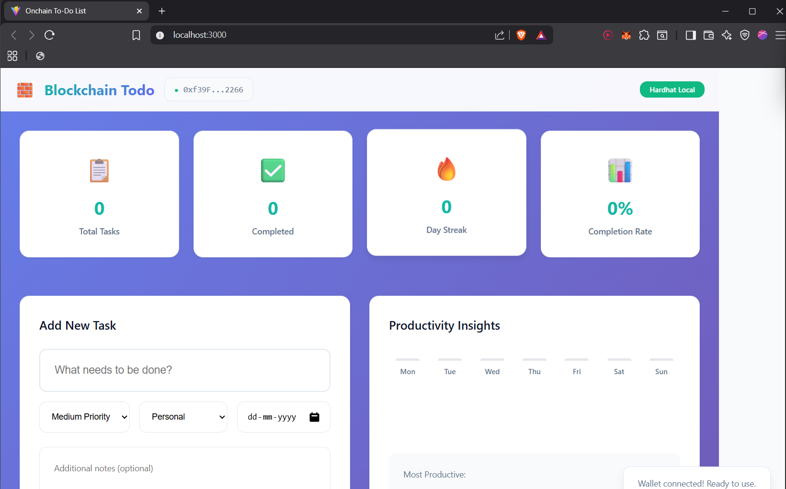
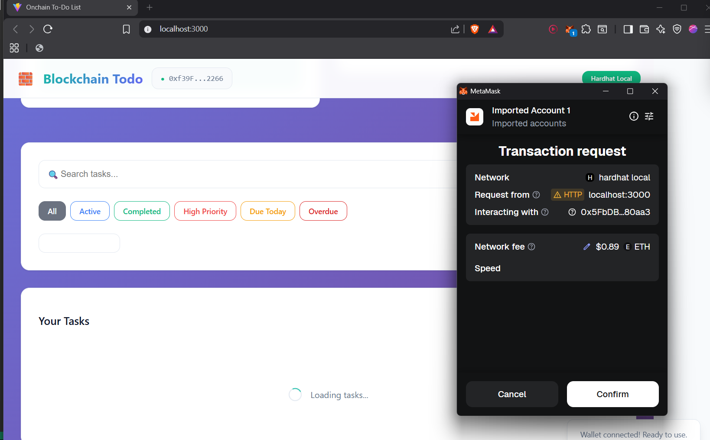
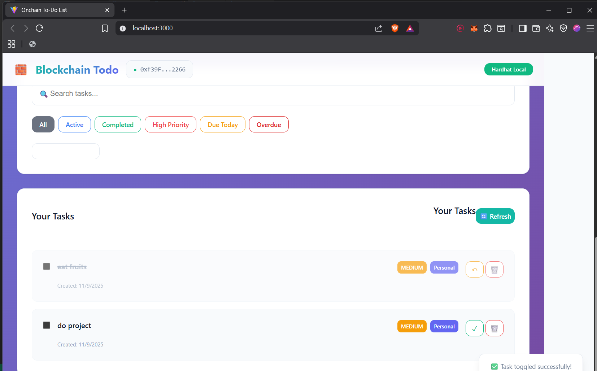
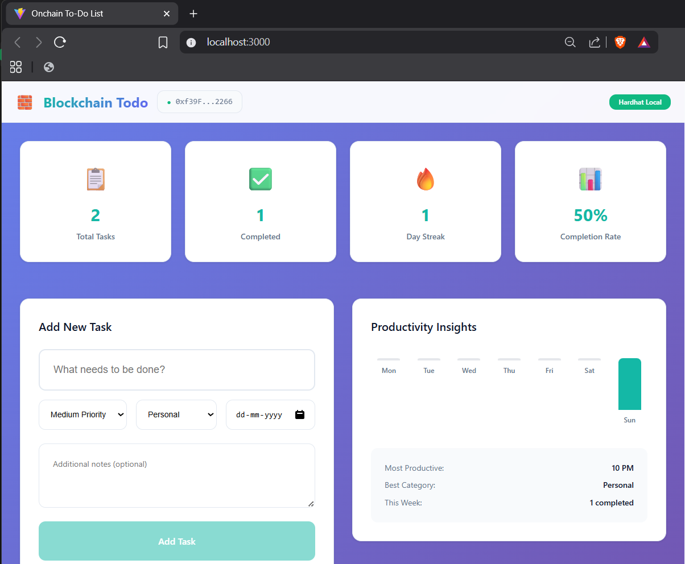

# Onchain Todo App

A decentralized todo application built on Ethereum blockchain using Solidity smart contracts and a modern React frontend. Manage your tasks securely on-chain with advanced features like productivity analytics, filtering, and bulk operations.

## 🚀 Features

- **Blockchain-Powered**: All tasks are stored on Ethereum blockchain for immutability and security
- **Decentralized Identity**: Connect with MetaMask wallet for secure task management
- **Advanced Analytics**: Track productivity with dynamic charts, completion rates, and day streaks
- **Smart Filtering**: Filter tasks by status, priority, category, due dates, and search functionality
- **Bulk Operations**: Complete or delete multiple tasks at once
- **Real-time Updates**: Instant synchronization with blockchain state
- **Responsive Design**: Works seamlessly on desktop and mobile devices
- **Priority & Categories**: Organize tasks with priorities (High/Medium/Low) and categories (Personal, Work, Shopping, etc.)
- **Due Date Tracking**: Set and track task deadlines with overdue notifications

## 🛠️ Tech Stack

### Backend (Smart Contract)
- **Solidity**: Smart contract development
- **Hardhat**: Development environment and testing framework
- **Ethers.js**: Ethereum interaction library

### Frontend
- **React**: UI framework with hooks
- **Vite**: Fast build tool and development server
- **Ethers.js**: Web3 integration
- **CSS3**: Modern styling with responsive design

### Development Tools
- **MetaMask**: Wallet integration for blockchain interaction
- **Hardhat Network**: Local Ethereum development network

## 📋 Prerequisites

- Node.js (v16 or higher)
- MetaMask browser extension
- Git

## 🚀 Quick Start

### 1. Clone the Repository
```bash
git clone <your-repo-url>
cd onchain-todo-app
```

### 2. Install Dependencies

#### Smart Contract Dependencies
```bash
cd onchain-todo
npm install
```

#### Frontend Dependencies
```bash
cd ../app-frontend
npm install
```

### 3. Start the Application

**Terminal 1: Start Hardhat Local Network**
```bash
cd onchain-todo
npx hardhat node
```

**Terminal 2: Deploy Smart Contract**
```bash
cd onchain-todo
npx hardhat run scripts/deploy.js --network localhost
```

**Terminal 3: Start Frontend Development Server**
```bash
cd app-frontend
npm run dev
```

### 4. Access the Application

1. Open your browser and navigate to `http://localhost:3000`
2. Click "Connect Wallet" and connect your MetaMask wallet
3. Switch to "Hardhat Local" network in MetaMask if prompted
4. Start managing your blockchain-powered todos!

## 📖 How to Use

### Connecting Your Wallet
- Click the "Connect Wallet" button
- Approve the connection in MetaMask
- Ensure you're on the Hardhat Local network

### Creating Tasks
- Enter your task in the input field
- Set priority, category, and due date (optional)
- Add notes for additional context
- Click "Add Task" to create it on-chain

### Managing Tasks
- **Complete Tasks**: Click the ✓ button to mark as done
- **Delete Tasks**: Click the 🗑️ button to remove permanently
- **Bulk Operations**: Select multiple tasks and use bulk complete/delete

### Filtering & Searching
- Use filter buttons to view active, completed, high-priority, or overdue tasks
- Search tasks by content, notes, or category
- Sort by newest, oldest, priority, due date, or alphabetically

### Analytics Dashboard
- View total tasks, completion rate, and day streak
- Check weekly productivity chart
- See most productive hour and best performing category

## 📸 Screenshots

### Main Dashboard

*Overview of tasks with analytics and productivity insights*

### Task Creation

*Advanced task creation with priority, category, and due date options*

### Task Management

*Filtering and bulk operations interface*

### Todo-App working

*Responsive design optimized for user friendly use*

## 🏗️ Project Structure

```
onchain-todo-app/
├── onchain-todo/              # Smart contract project
│   ├── contracts/
│   │   └── OnchainTodo.sol    # Main smart contract
│   ├── scripts/
│   │   └── deploy.js          # Deployment script
│   ├── test/                  # Contract tests
│   └── hardhat.config.js      # Hardhat configuration
├── app-frontend/              # React frontend
│   ├── src/
│   │   ├── components/        # React components
│   │   ├── App.jsx            # Main app component
│   │   └── artifacts/         # Contract ABIs
│   ├── public/                # Static assets
│   └── package.json           # Frontend dependencies
└── README.md                  # This file
```

## 🔧 Smart Contract Details

### OnchainTodo Contract

**Key Functions:**
- `createTask(string content)`: Create a new task
- `toggleTask(uint256 id)`: Toggle task completion status
- `deleteTask(uint256 id)`: Delete a task (swap-and-pop for gas efficiency)
- `getMyTasks()`: Retrieve all user tasks
- `getMyTasks(uint256 offset, uint256 limit)`: Paginated task retrieval
- `getTaskCount()`: Get total task count for user

**Events:**
- `TaskCreated`: Emitted when a new task is created
- `TaskUpdated`: Emitted when task status changes
- `TaskDeleted`: Emitted when a task is deleted

## 🤝 Contributing

1. Fork the repository
2. Create a feature branch (`git checkout -b feature/amazing-feature`)
3. Commit your changes (`git commit -m 'Add amazing feature'`)
4. Push to the branch (`git push origin feature/amazing-feature`)
5. Open a Pull Request

## 📄 License

This project is licensed under the MIT License - see the [LICENSE](LICENSE) file for details.

## 🙏 Acknowledgments

- Built with Hardhat and React
- Inspired by modern productivity apps
- Thanks to the Ethereum community for blockchain infrastructure

## 📞 Support

If you encounter any issues or have questions:
- Check the [Issues](https://github.com/lankasreenaina) page
- Create a new issue with detailed description
- Include your environment details and error messages

---

**Note**: This is a development project using local Hardhat network. For production deployment, additional security audits and optimizations would be required.

# Blockchain-Todo
A hardhat Blockchain and Metamask wallet Decentralised Todo List App

